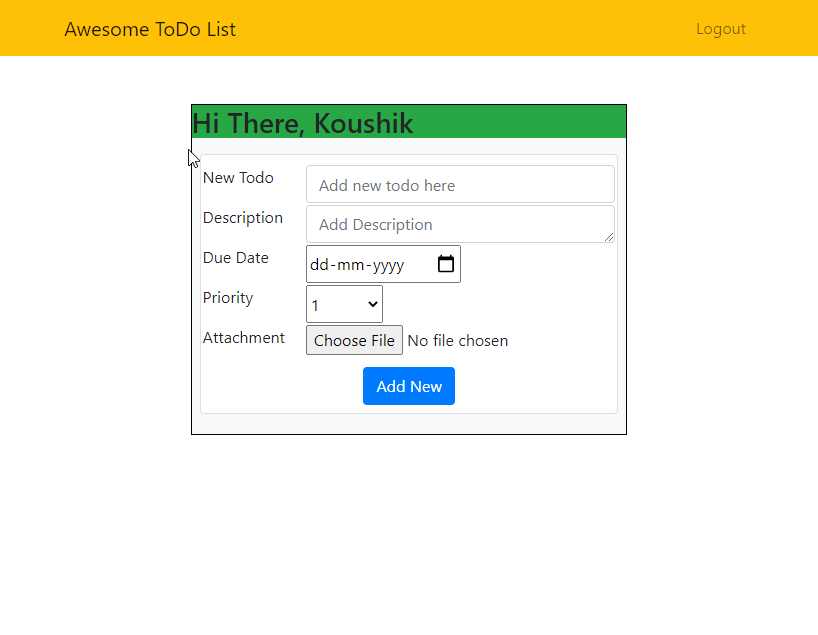

## Django To Do App
### A To Do App & API built with Django 3 and django-rest-framework
---

_This project is not meant for yet another fancy To Do application, but to provide a boilerplate to quickly get started with Django 3 as backend and setup django-rest-framework as a RESTful API._

Log In Page             |  Home Page
:-------------------------:|:-------------------------:
  |  

## Features
1. REST API to create, read, update, delete (CURD) To Dos.
2. User authentication. Simultaneousely can have multiple users, each having their own To Dos hidden from each other.
3. Search through ToDos.

## Things to learn
1. Django 3 for web backend and serve on local network.
1. Django templating language.
2. Setting up a REST API with CURD operations.
3. Seperating frontend and backend and how to communicate with each other through a REST API.
4. Settting up an API for User registration, log-in and log-out.
5. Django serch filter.

## Getting Started
1. Install Django 3 and django-rest-framework
2. Make makemigrations and migrate
3. Make superuser
4. Run server
5. Use the app